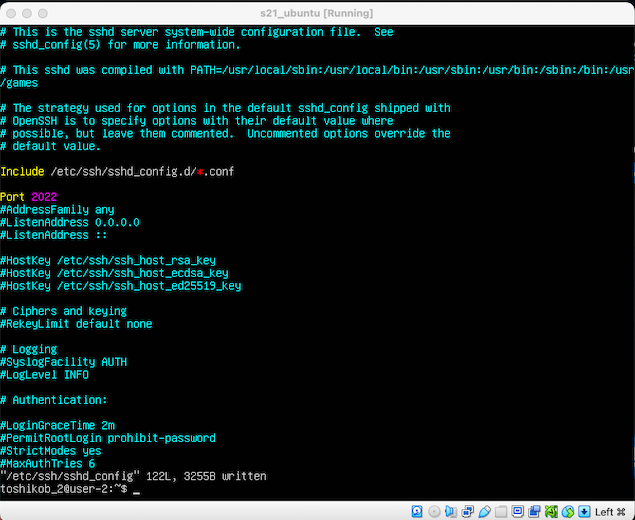

## Part 1

* 1.Вывод команды cat /etc/issue (Скриншот_1)

## Part 2

* 1.С помощью команды sudo adduser _username_ создаем пользователя toshikob_2 (Скриншоты_2_3)

* 2.Добавляем пользователя в папку adm используя команду sudo usermod -aG adm toshikob_2 (Скриншот_4)

* 3.Вывод команды cat /etc/passwd (Скриншот_5)

## Part 3

* 1.Используя команду sudo hostnamectl set-hostname user-1 переименовываем машину (Скриншот_6)

* 2.Устанавливаем дату и время с помощью команды sudo timedatectl set-timezone Europe/Moscow (Скриншот_7)

* 3.Отображаем имена сетевых интерфейсов командой hostnamectl (Скриншот_8)

* 4.Интерфейс "lo" - это сетевой интерфейс, который представляет собой "петлевой" интерфейс, или интерфейс обратной связи, в ОС Linux. Этот интерфейс создается автоматически при запуске операционной системы и имеет IP-адрес "127.0.0.1".

Интерфейс "lo" используется для тестирования и настройки сетевых приложений на локальном компьютере, а также для обмена данными между различными сетевыми приложениями на одном и том же компьютере. Например, если вы хотите запустить веб-сервер и протестировать его работу на локальном компьютере, вы можете использовать интерфейс "lo" для доступа к серверу через локальный IP-адрес 127.0.0.1.

Важно отметить, что интерфейс "lo" не связан с какой-либо физической сетевой картой и не соединен с внешней сетью. Он существует только в операционной системе и используется только для обмена данными между различными сетевыми приложениями на одном компьютере.

* 5.Используем команду ip addr show и отображаем ip адресс в консоли (Скриншоты_9_10)

* 6.DHCP (Dynamic Host Configuration Protocol) - это протокол автоматической настройки IP-адресов, который позволяет компьютерам автоматически получать IP-адрес, маску подсети, адрес шлюза и другие настройки сети от DHCP-сервера

* 7.Вызываем команду curl ifconfig.me – это позволит нам узнать внешний и внутренний ip-адреса шлюза (Скриншот_11)

* 8.Путь к файлу для изменения статических настроек user-1/etc/netplan

* 9.Открываем файл 00-installer-config.yaml с помощью команды sudo vim

* 10.Задаем следующие настройки: (Cкриншот_12)

* 11.Исполняем команду sudo reboot

* 12.Результат работы команды ping ya.ru – (Скриншот_13)

* 13.Результат работы команды ping 1.1.1.1 – (Скриншот_14)

## Part 4

* 1.Исполняем команду sudo apt update && sudo apt upgrade

* 2.Повторно запускаем команду sudo apt update (Скриншот_15)

## Part 5

* 1.Команда sudo – SuperUser DO, команда в ОС Linux которая предоставляет пользователю временные привилегии супер-пользователя. Позволяет выполнять задачи требующие высокого уровня авторизации – установка программ, запуск системных служб и.т.д.

* 2.Во второй части мы создали пользователя toshikob_2. Наделяем его правами супер-пользователя с помощью команды sudo adduser toshhikob_2 sudo. (Скриншот_16)

* 3.Проверяем доступ пользователя toshikob_2 с помощью команды sudo -l -U toshikob_2. (Скриншот_17)

* 4.sudo reboot и логинимся под пользователя toshikob_2.

* 5.Используем команду sudo hostnamectl set-hostname user-2 чтобы изменить, согласно заданию, имя нашего хоста. Используем команду sudo reboot, авторизуемся под пользователем toshikob_2, проверяем успешность выполненного задания с помощью команды hostnamectl. (Скриншот_18)

## Part 6

* 1.Проверяем синхронизацию временных настроек с помощью команды – timedatectl status. (Скриншот_19)

* 2.Подключаем автоматическую синхронизацию временных настроек с помощью команды sudo timedatectl set-timezone Europe/Moscow

## Part 7

* 1.Устанавливаем необходимый текстовый редактор, в моем случае это JOE, так как VIM и NANO уже были установлены ранее, с помощью команды sudo apt install joe_vim_nano_e.t.c

* 2.(Скриншот_20), подтверждает наличие всех трех файлов.

* 3.(Скриншоты_21_PLCHLD) с соответствующим суффиксом, для каждого из текстовых редакторов.

* 4.Команда для запуска joe – joe filename. Для выхода с сохранением, ctrl+k & Q, редактор предложит опцию сохранения. Отвечаем y & ENTER

* 5.Команда для запуска nano – nano filename. Для выхода используем клавиши ctrl+x. Программа предложит сохранить изменения. Отвечаем Y, подтверждаем имя файла с помощью клавиши ENTER

* 6.Команда для запуска vim – vim filename. Для выхода с сохранением используем сиквенс клавиш ESC -> : -> wq. В случае если возникнут проблемы с записью по команде wq используем овверрайд команду wq!

* 7.Разница с выходом без сохранения во всех редакторов отличается минимально от выхода с сохранением. В случае с JOE и NANO мы используем все те же сочетания клавиш, только на предложение о сохранении изменений отвечаем N(NO). Для VIM разница залючается в том что мы используем не сочетание wq(write-quit),  а q(quit). В случае возникновения проблем так же используем команду q!(override). Смотрите набор (Скриншотов_22)

* 8.Чтобы произвести замену по шаблону в NANO  необходимо использовать сиквенс клавиш ctrl+\, после чего редактор попросит ввести искомый шаблон, затем шаблон на замену. Подтверждаем оба выбора нажатием клавиши ENTER. Редактор предложит подтвердить замену нажатием одной из клавиш. Y -yes(заменит одну из инстанций шаблона, начиная с первой), A -all(заменит все совпадения сразу). (Скриншоты_23_NANO)

Для замены по шаблону в редакторе VIM используем сочетания команд ESC -> : , в командной строке набираем ->
s(команда на поиск шаблона)/pattern(который надо найти)/pattern(на который надо заменить)  ->
s/pattern/pattern (заменит первый паттерн в строке)
s/pattern/pattern/g (заменит паттерны во всей строке)
%s/pattern/pattern/g(заменит паттерны во всем файле)
(Скриншоты_23_VIM)

Замена по шаблону в текстовом редакторе JOE производится следующим образом – сочетанием клавиш CTRL + K, после чего мы нажимаем клавишу F(find). Редактор предлагает нам найти слово. В нашем случае toshikob, затем JOE предлагает набор опций  среди которых нас интересует R(replace). Даем команду. Редактор предлагает заменить первое слово Y(yes) или все совпадения R(rest). Выбираем вторую опцию и сохраняем файл. (Скриншоты_23.1_JOE - Скриншоты_23.6_JOE)

## Part 8

* 1.Устанавливаем SSH сервер с помощью команды sudo apt install openssh-server (Скриншот_24)

* 2.Активируем службу SSHd чтобы она запускалась автоматически при загрузке системы посредством команды -sudo systemctl enable ssh (Скриншот_25)

* 3.С помощью команды sudo vim /etc/ssh/sshd_config заходим в конфигурационный файл. Раскомментируем строчку с портом, изменяем параметр с 22 на 2022.(Скриншот_26)

* 4.Верифицируем новые настройки с помощью команды sudo systemctl restart sshd (Скриншот_27)

* 5.С помощью команды ps aux | grep sshd проверяем наличие процесса(Скриншот_28)

* 6.Вывод команды netstat -tan (Скриншот 29)

* 7. Команда netstat -tan показывает список всех активных сетевых соединений (TCP и UDP) на компьютере, а также статистику каждого соединения. 
Расшифровка параметров:

    t - показывает активные TCP-соединения (Transmission Control Protocol).
    a - показывает все активные соединения, включая те, что находятся в состоянии ожидания (listening). 
    n - отключает разрешение имен хостов и портов на числовые адреса, что ускоряет работу команды. 
    Proto - Протокол (tcp, udp, raw), используемый сокетом. 
    Recv-Q - Счётчик байт не скопированных программой пользователя из этого сокета. 
    Send-Q - Счётчик байтов, не подтверждённых удалённым узлом. 
    Local Address - Адрес и номер порта локального конца сокета. Если не указана опция --numeric (-n), адрес сокета преобразуется в каноническое имя узла (FQDN), и номер порта преобразуется в соответствующее имя службы. 
    Foreign Address - Адрес и номер порта удалённого конца сокета. Аналогично "Local Address." 
    State - состояние соединения (established - установлено, listening - ожидание, time_wait - закрыто и т.д.). 
    В выводе команды netstat -tan, 0.0.0.0:* означает, что процесс или служба прослушивает все доступные сетевые интерфейсы на локальной машине. 

## Part 9

* 1.Вывод команды top (Скриншот_30):

uptime: время работы системы можно увидеть в верхней строке вывода команды top под названием "up". В нашем случае система работает 37 минут. 
Количество авторизованных пользователей можно увидеть в верхней строке вывода команды top под названием "users". Например, "1 users" означает, что на данный 
момент в системе залогинены 1 пользователя. 
Общую загрузку системы можно увидеть в верхней строке вывода команды top под названием "load average". Это три значения, разделенные запятой, которые показывают 
загрузку системы за последние 1, 5 и 15 минут соответственно. Например, "0.46, 0.36, 0.36" означает, что средняя загрузка системы за последние 1, 5 и 15 минут 
составляет 0.46, 0.36 и 0.36 соответственно. 
Общее количество процессов можно увидеть в верхней строке вывода команды top под названием "Tasks". Например, "102 total" означает, что в системе запущено 102 
процесса. 
Загрузку CPU можно увидеть в верхней части вывода команды top в строке "Cpu(s)". Здесь отображается информация о процессоре, включая общую загрузку процессора в 
процентах и загрузку каждого ядра процессора. Например, "0.0%us, 0.0%sy, 0.0%ni, 99.7%id, 0.0%wa, 0.0%hi, 0.0%si, 0.0%st" означает, что процессор загружен на 0% 
пользовательскими процессами (us), на 0% системными процессами (sy), на 0 % процессами, запущенными с измененным приоритетом (ni), 100% процессами в ожидании (id), 
на 0.0% операциями ввода-вывода (wa), на 0% аппаратными прерываниями (hi) и 0% сигналами (si). 
Загрузка памяти отображается в верхней части вывода команды top и включает информацию о всей доступной памяти, используемой памяти и свободной памяти. 
Например, 1976 total, 1316.4 free, 209.8 used, 449.9 buff/cache означает, что 1976.0 памяти всего, 1316.4 из неё свободно, 209.8 используется и 449.9 занято 
буфером и кэшом. 

1.1.Сочетание клавиш Shift+m позволяет отсортировать процессы по использованию памяти (Скриншот_31)

1.2.Сочетание клавиш Shift+m позволяет отсортировать процессы по времени работы (Скриншот_32)

* 2.Вывод команды htop (Скриншот_33):

2.1.Нажатие клавиши F6 дает нам доступ к опциям сортировки (Скриншот_34)

2.2.После того как мы выбрали определенную опцию, мы можем добавить дополнительный параметр сортировки с помощь сочетания клавиш Shift+F6 

2.3.Команда для поиска syslog – htop -p $(pgrep syslog) (Скриншот_35)

## Part 10

* 1.Вызываем команду sudo fdisk -l (Скриншот_36)

Есть три раздела:
 
загрузочный раздел / dev / sdb1 
swap раздел / dev / sdb2 
Корневой раздел / dev / sdb3

Название жесткого диска: /dev/sda, размер 10.04 gib, 21055488 секторов, размер swap раздела 1.8 gib. 

## Part 11

* 1.Вывод команды df (Скриншот_37):

1.1.размер раздела – 8448696 kb

1.2.размер занятого пространства – 4577228 kb

1.3.размер свободного пространства 3420704 kb

1.4.процент использования – 58%. 

1.5.1K-блок - это единица измерения размера блока в файловых системах. Он равен 1024 байтам или 1 килобайту. 

* 2.Вывод команды df -Th (Скриншот_38):

2.1.размер раздела – 8.1 gb

2.2.размер занятого пространства – 4.4 gb

2.3.размер свободного пространства 3.3 gb, процент использования – 58%. 

2.4.ext4 - это файловая система, используемая в операционной системе Linux. 

## Part 12

* 1.Вывод команды du (Скриншот_39):

* 2.Команда sudo du -sh _option - осуществляет вывод запрашиваемой информации где s – вывод только общего размера, а h – в единицах измерения удобных для прочтения 
человеком. Подставляем имя нужной директории на место _option в командной строке и получаем запрашиваемый вывод (Скриншот_40)

* 3.Вывод команды sudo du -sh var/log/* (Скриншот_41) – дает информацию отдельно по каждому элементу директории 

## Part 13

* 1.Используем команду sudo apt install ncdu – для установки утилиты (Скриншот_42)

* 2.Пример работы команды ncdu в директории toshikob_2 (Скриншот_43). Для выхода из утилиты используем клавишу Q(quit)

* 3.Используем команду sudo ncdu _option - (Скриншоты_44 - > 46)

## Part 14

* 1.Используем команду last -a для вывода информации о логин сессиях пользователей (Скриншот_47)

Имя пользователя – toshikob
Метод входа – tty1 – консольный метод входа

* 2.sudo systemctl restart sshd - для перезапуска сервиса sshd

* 3.Открываем лог с помощью команды sudo vim/var/log/syslog – (Скриншот_48)

## Part 15

* 1.Crontab – утилита позволяющая осуществлять вызов команд в плановом автоматическом порядке. С помощью нее пользователь может устанавливать время и периодичность 
вызова команды или целого ряда команд системой.
Вызываем команду crontab -e для открытия меню кронтаб.(Скриншот_49)

* 2.Задаем нужные настройки и сохраняем файл (Скриншот_50)

* 3.Проверяем содержимое кронтаба с помощью команды crontab -l (скриншот_51)

* 4.sudo grep “uptime” syslog – позволит нам отобразить содержимое системного лога, конфигурация кронтаб осуществляла автоматический вызов команды uptime 
(Скриншот_52)

* 5.Используем команду crontab -r для очистки конфигурационного файла кронтаб, crontab – l для отображение этого файла. Он пуст, как и предполагалось. (Скриншот_53)

